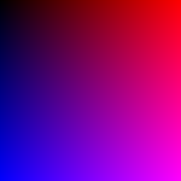

# Atividade 1

Neste projeto, geramos imagens de um degradê, um círculo e um quadrado e salvamos nos formatos PPM (P3) e PNG 
Para salvar as imagens em PNG, utilizamos a [STB image library](https://github.com/nothings/stb).

# Imagens geradas

### Degradê


### Círculo


### Quadrado


## Como compilar

Basta utilizar o g++:

```g++ atividade1.cpp -o atividade1```