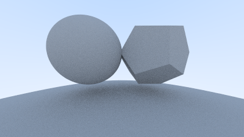
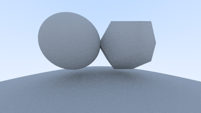
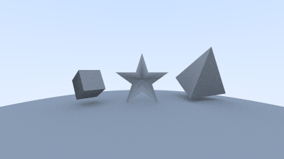
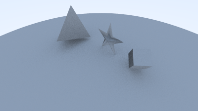

# Atividade 6

Nesta ativadade, concluímos os capítulos 6, 7, 8, 9 e 12 do tutorial e aplicamos os conceitos a modelos .obj

Aprendemos a lidar com normais de faces e vetores, aplicar anti-aliasing, renderizar materias difusos e criar uma câmera móvel.

## Smooth Shading

Uma dos pontos mais interessantes desta etapa foi a interpolação de normais utilização coordenadas baricentricas para fazer "smooth shading".
Pode se ver um exemplo da aplicação do conceito nas imagens de um dedocaedro com e sem interpolação abaixo.

 

## Resultado

Após a união de todos os conceitos, foi possível atingir o objetivo da tarefa e gerar uma cena com objetos vistos por dois ângulos. Nesta cena utilizamos uma esfera como chão, e os modelos dos arquivos `cube.obj`, `20facestar.obj`, `tri-pyramid.obj` localizados no diretório `resources`. A rotina principal gera um "mundo" com os objetos e cria duas câmeras com parâmetros distintos para renderizar as imagens `camera1.ppm`, `camera1.png`, `camera2.ppm` e `camera2.png` no diretório de execução.

### Camera 1

### Camera 2

## Como compilar

Primeiro geramos os build files com `cmake` a partir do diretório raíz desta atividade

`cmake -S . -B build`

Então podemos ir ao diretório `build` e compilar o projeto com `make`

`cd build && make`

Para rodar os testes, basta rodar o `ctest`, ainda dentro o diretório build

`ctest`