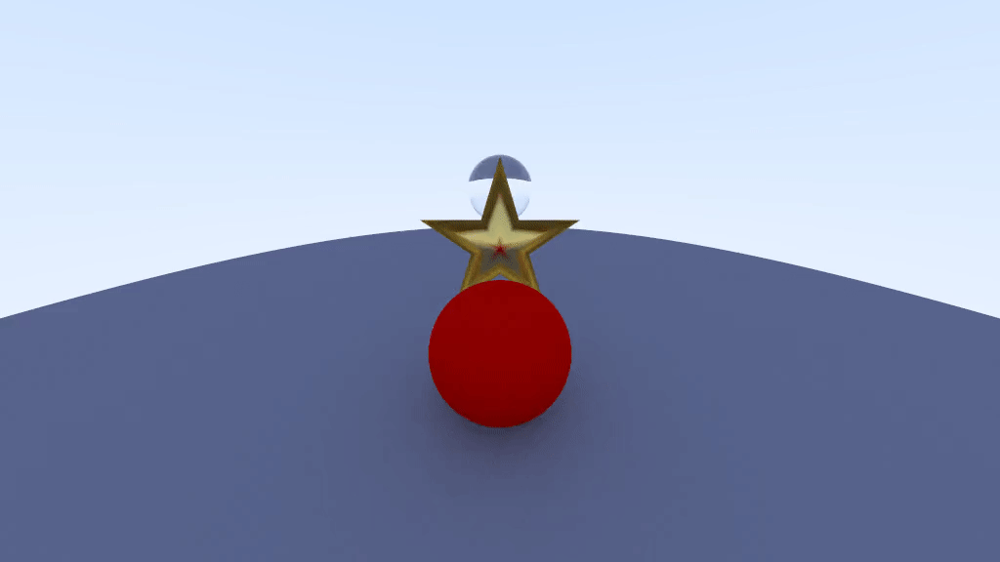

# Projeto final da disciplina de Computação Gráfica (2023/2)

### Universidade Federal de São Carlos (UFSCar) - Campus Sorocaba

Renan Rossignatti de França - RA: 489697

Professor: Mario Liziér

## Proposta do projeto

- Gerar quadros para uma animação de 5 segundos, utilizando conceitos das demais atividades da disciplina.
- Juntar quadros em um vídeo gerado com a software `ffmpeg`
- 4 objetos na cena
    - Uma grande esfera azul **difusa** representando o "chão"
    - Uma estrela de 20 faces de **metal**
    - Uma esfera vermelha **difusa**
    - Uma esfera de **vidro**
- Movimentos
    - A câmera gira 360 graus em torno da cena 
    - A esfera vermelha gira 720 graus em torno da estrela
    - A estrela ao centro gira 216 graus em torno do seu eixo z, de forma que sua terceira ponta à esquerda para torna a ponta do topo
    - A esfera de vidro e o "chão" ficam parados

## Resultado

### O resultado foi gerado utilizando as seguintes configurações de câmera:

`image_width`: 1024

`samples_per_pixel`: 100

`max_depth`: 50

### Para a animação, utilizamos:

`duration`: 5 segundos

`frames_per_second`: 15

### Tempo de renderização:

As configurações de duração e quadros por segundo resultaram na necessidade de gerar 75 quadros.

Devido a alta resolução e amostras (raios) por pixel escolhidos para obter o resultado final, Isto resultou num tempo médio de aproximadamente 90 segundos por quadro e um tempo total de aproximadamente 114 minutos.

### Vídeo

Para gerar o vídeo, foi utilizado o comando abaixo do software `ffmpeg` no diretório `build` onde as imagens são geradas:

`ffmpeg -framerate 15 -i frame_%d.png -c:v libx264 -r 15 out.mp4`

Também foi criado um arquivo `.gif` a partir do arquivo mp4 com:

`ffmpeg -i out.mp4 -filter_complex "[0:v] split [a][b];[a] palettegen [p];[b][p] paletteuse" output_trimmed_enhanced.gif`

## Como compilar

Primeiro geramos os build files com `cmake` a partir do diretório raíz desta atividade

`cmake -S . -B build`

Então podemos ir ao diretório `build` e compilar o projeto com `make`

`cd build && make`

## Referências

- [Ray tracing in one weekend por Peter Shirley, Trevor David Blacka e Steve Hollasch](https://raytracing.github.io/books/RayTracingInOneWeekend.html)

- [Object Files (.obj) por Paul Bourke](https://paulbourke.net/dataformats/obj/)

- [Ray-Tracing: Rendering a Triangle (https://www.scratchapixel.com/)](https://www.scratchapixel.com/lessons/3d-basic-rendering/ray-tracing-rendering-a-triangle/barycentric-coordinates.html)
