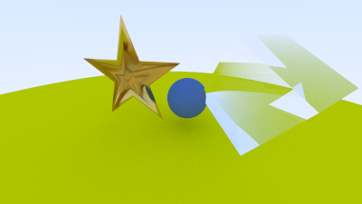

# Projeto Final

Nesta ativadade, concluímos os capítulos 10 e 11 do tutorial e aplicamos os conceitos a modelos .obj

Aprendemos a lidar com novos materiais, metal e vidro, e como descrever no código a interação dos raios da cena com eles.

## Resultado

A cena final conta com o chão composto por uma grande esfera verde como no tutorial. A esquerda temos uma estrela feita de metal dourado (`20facestar.obj`). A direita, temos um cubo de vidro (`cube.obj`).Ao centro, uma esfera feita de material difuso que aparece no reflexo de ambos objetos. A rotina principal gera este cenário e renderiz a imagem salva como `camera.ppm` e `camera.png` no diretório de execução.

## Como compilar

Primeiro geramos os build files com `cmake` a partir do diretório raíz desta atividade

`cmake -S . -B build`

Então podemos ir ao diretório `build` e compilar o projeto com `make`

`cd build && make`